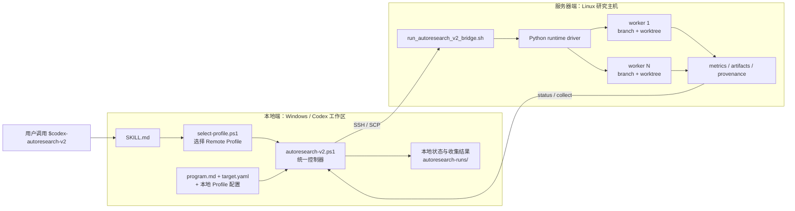

# AUTORESEARCH

面向 Codex 的通用远程实验编排 skill。它通过本地 Windows 控制层连接研究服务器，在隔离的 Git branch/worktree 中并行运行候选实验，并依据有限数值指标决定保留或丢弃结果。

当前发布版本：`0.5.0`。

## 核心能力

- 使用显式 Remote Profile 选择和诊断研究服务器；
- 通过 OpenSSH/SCP 部署并调用服务器端 bridge；
- 为每个 worker 创建独立 branch 和 worktree；
- 建立唯一 baseline，并按 `primary_metric`、方向和阈值保留改进；
- 支持后台运行、恢复、停止、状态查询和结果收集；
- 支持可选 GPU lease，`gpu.mode: none` 保持纯 CPU 模式；
- 记录 argv、Git 状态、输入哈希、指标、artifact 哈希和生命周期事件；
- 分离调用模式与开发模式，防止实验过程中误改运行时实现。

## 工作原理



本地端负责 Profile、SSH/SCP、输入校验和生命周期控制；服务器端只接收通用运行参数，不依赖本地 Profile，也不包含特定研究项目的解析逻辑。

## 仓库结构

```text
.agents/skills/codex-autoresearch-v2/      # 调用 skill
.agents/skills/codex-autoresearch-v2-dev/  # 开发与打包 skill
.codex/research-policy.json                # 模式、密封路径与版本事实源
autoresearch/                               # program/target 示例
config/                                    # Remote Profile 示例
scripts/remote/                             # 本地控制器与服务器 runtime
tests/autoresearch_v2/                      # 契约与回归测试
plugins/codex-autoresearch-v2/              # 生成的安装包
.agents/plugins/marketplace.json            # GitHub marketplace 清单
```

`plugins/codex-autoresearch-v2/` 是生成产物；规范源码位于 `.agents/skills/codex-autoresearch-v2/` 和 `scripts/remote/`。不要直接修改生成包。

## 环境要求

本地端：Windows、`powershell.exe`、OpenSSH Client、Python 3、Git，以及 Codex CLI 或支持 skills/plugins 的 Codex 桌面端。

服务器端：Linux shell、Python 3、Git，并且能够通过本地 OpenSSH 配置访问。若使用 GPU lease，服务器还需提供 target 配置要求的设备查询命令。

## 使用方式一：克隆后直接运行

```powershell
git clone https://github.com/westriver-moon/AUTORESEARCH.git
Set-Location AUTORESEARCH
Copy-Item config\autoresearch-v2.example.psd1 config\autoresearch-v2.local.psd1
```

编辑 `config/autoresearch-v2.local.psd1`，然后在该仓库中启动 Codex，并显式调用：

```text
$codex-autoresearch-v2
```

skill 会先运行本地 Profile 选择器，再使用统一入口：

```text
scripts/remote/autoresearch-v2.ps1
```

## 使用方式二：从 GitHub marketplace 安装

根据 Codex 官方插件流程添加本仓库：

```text
codex plugin marketplace add westriver-moon/AUTORESEARCH --ref main
```

随后启动 Codex CLI，输入 `/plugins`，切换到 `AUTORESEARCH` marketplace，安装并启用 `codex-autoresearch-v2`。安装或升级后应开启一个新会话。

插件提供通用控制器和 skill；具体服务器 Profile、项目仓库路径、实验命令与可修改路径仍由你的工作区配置和 target 定义。

## 配置服务器访问

将机器相关配置写入不会提交的 `config/autoresearch-v2.local.psd1`。私钥、跳板机、HostKey 策略和认证应保留在用户 OpenSSH 配置中，不要写入 program 或 target。

配置的主要部分包括：

- `RemoteProfiles`：可选择的服务器；
- `ActiveRemoteProfile`：默认 Profile；
- `RemoteControllerRoot`：服务器端控制器目录；
- `RemoteRunRoot`：运行状态目录；
- `RemoteWorktreeRoot`：隔离 worktree 根目录；
- `RemoteLeaseRoot`：可选资源 lease 目录；
- `ProxyMode`：`disabled`、`optional` 或 `required`。

在任何 SSH 操作前选择 Profile：

```powershell
powershell.exe -NoProfile -ExecutionPolicy Bypass -File scripts\remote\select-profile.ps1
```

## 准备实验输入

从以下文件开始：

- `autoresearch/program-example.md`：研究目标、指标方向、预算和 worker 数；
- `autoresearch/targets/example-cpu.yaml`：schema v2 目标、仓库路径、argv、可修改路径和 artifact。

所有新 target 必须使用：

```yaml
schema_version: 2
```

`run.argv` 是 argv 数组，不是 shell 命令。项目特定的配置展开、日志解析和报告生成应由 `run.argv` 指向的项目命令负责。

实验命令成功前必须原子写入 `$AR2_RESULTS_DIR/metrics.json`。最小格式：

```json
{
  "primary_metric": 12.5
}
```

指标必须是有限 JSON 数值；runtime 不从 stdout 猜测指标。

## 典型生命周期

统一控制器支持：

```text
access-doctor  access-ensure  deploy  doctor  bootstrap  inspect
apply          baseline       run     resume  status     collect
stop           sync-best
```

推荐顺序：

1. 选择 Remote Profile；
2. 使用 `access-doctor` 验证 SSH/代理；
3. 使用 `doctor` 校验 program、target 和服务器环境；
4. `bootstrap` 创建 worker branch/worktree；
5. 建立 `baseline`；
6. `apply` 候选修改并执行 `run`；
7. 使用 `status` 检查进度；
8. 使用 `collect` 收集指标、provenance 和 artifacts。

## 模式边界

- `$codex-autoresearch-v2`：只调用已完成的运行时，允许修改 program、target 和 target 声明的 mutable paths；
- `$codex-autoresearch-v2-dev`：仅在明确开发、修复、验证或打包 Autoresearch 时使用。

权威边界位于 `.codex/research-policy.json`。调用模式不得修改其中列出的 sealed paths。

## 验证

```powershell
$env:PYTHONDONTWRITEBYTECODE = '1'
python -m pytest -p no:cacheprovider tests/autoresearch_v2 -q
powershell.exe -NoProfile -ExecutionPolicy Bypass -File scripts\remote\run-local-checks.ps1 -Json
```

重新生成安装包：

```powershell
powershell.exe -NoProfile -ExecutionPolicy Bypass -File scripts\package-autoresearch-v2-plugin.ps1
```

发布前的当前基线为 `32 passed`。

## 安全说明

- 只连接显式配置并由用户选择的研究服务器；
- 不在仓库中保存 SSH 私钥或密码；
- `config/autoresearch-v2.local.psd1`、`autoresearch-runs/` 和缓存文件已被忽略；
- 每个 worker 使用独立 branch/worktree；失败或丢弃的 worker 回到 retained best commit；
- 请在可信仓库和符合组织安全策略的服务器上运行。

## 相关文档

- [OpenAI：Build plugins](https://developers.openai.com/plugins/build/plugins)
- [OpenAI：Build skills](https://developers.openai.com/plugins/build/skills)
