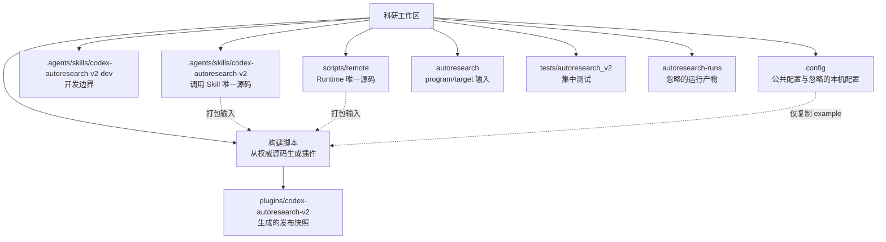

# Autoresearch v2 分布与精简实施计划

## 实施结果（2026-08-06）

阶段 0 至阶段 5 已全部实施。最终状态：

| 项目 | 实施前 | 实施后 |
|---|---:|---:|
| 调用 Skill 文件 | 13 | 9 |
| 调用 Skill 行数 | 520 | 469 |
| 插件文件 | 30 | 26 |
| 根 README 行数 | 76 | 35 |
| Runtime README 行数 | 64 | 27 |
| 验证入口 | 3 个 Python 文件 | 1 个带子命令的合同 CLI |
| 完整 `sealed_paths` 来源 | 4 处 | 1 处 |

插件现在由 `scripts/package-autoresearch-v2-plugin.ps1` 从权威源码确定性生成。最终 32 项正式回归测试、PowerShell 解析、两个 Skill 校验、插件校验、本地合同检查和真实只读 `access-doctor` 均通过；临时运行目录、临时测试脚本和测试缓存已清理。

## 1. 目的

在不改变现有调用方式、远端执行语义和安全边界的前提下，减少 Autoresearch v2 的重复源码、重复配置和重复文档，明确项目本地源码、插件发布物、运行输入与运行产物的边界。

本计划优先解决维护冗余，不以减少测试覆盖率或合并合理的本地/远端职责为目标。

## 2. 实施前基线

当前 Autoresearch v2 位于本地工作区 `C:\Users\pbrii\Desktop\科研`，未发现安装在用户全局 Codex skill 或插件目录中的副本。

| 区域 | 当前职责 | 文件数 | 约计行数 | 判断 |
|---|---:|---:|---:|---|
| `.agents/skills/codex-autoresearch-v2/` | 调用型 Skill | 13 | 520 | 权威源码 |
| `.agents/skills/codex-autoresearch-v2-dev/` | 开发型 Skill | 2 | 69 | 权威源码 |
| `scripts/remote/` | 本地控制器、访问层、远端 Runtime | 16 | 3398 | 权威源码 |
| `plugins/codex-autoresearch-v2/` | 可发布插件 | 30 | 3739 | 主要为镜像副本 |
| `autoresearch/` | program/target 输入模板 | 3 | 64 | 项目输入 |
| `config/` | 策略与本机配置 | 3 | 147 | 配置入口 |
| `tests/` | 合同、模式、访问层和 Runtime 测试 | 8 | 923 | 验证代码 |

插件目录中约 3704 行与 Skill、Runtime、配置模板完全相同，是当前最大的物理冗余和维护风险。

此外，`sealed_paths` 在策略文件、配置文件、开发 Skill 和模式合同中重复维护；远程访问字段在示例配置、默认值和字段白名单中重复声明。

## 3. 精简原则

1. 每类信息只能有一个权威来源。
2. 插件是构建产物，不是第二套手工维护源码。
3. 保留调用 Skill、开发 Skill、本地控制器和远端 Runtime 的职责边界。
4. 保留 example/local 配置分离；不得将本机地址、用户名或凭据写入可发布包。
5. 每个阶段独立可验证、可回退，不进行一次性大搬迁。
6. 先消除漂移风险，再减少文件数量。

## 4. 目标分布



### 4.1 保留的权威来源

| 信息 | 唯一权威来源 |
|---|---|
| 调用流程、触发条件 | `.agents/skills/codex-autoresearch-v2/SKILL.md` |
| 开发权限和操作流程 | `.agents/skills/codex-autoresearch-v2-dev/SKILL.md` |
| 模式、密封路径、插件版本 | `.codex/research-policy.json` |
| 本地控制与远程访问实现 | `scripts/remote/*.ps1`、`scripts/remote/lib/*.ps1` |
| 远端状态机 | `scripts/remote/remote-bin/*` |
| 公共默认配置 | `config/autoresearch-v2.example.psd1` |
| 本机服务器 Profile | `config/autoresearch-v2.local.psd1`，保持 Git 忽略 |
| program/target Schema | Skill 中的合同模块及 reference |
| 发布包元数据 | 插件 manifest；构建时与策略版本交叉验证 |

## 5. 分阶段实施

### 5.1 阶段 0：冻结基线

#### 工作项

- 保存当前相关测试清单和通过结果。
- 记录权威源码与插件镜像的相对路径和 SHA-256。
- 确认 `autoresearch-v2.local.psd1`、`autoresearch-runs/` 和 Python 缓存均受忽略规则保护。
- 将当前支持的 CLI 模式和参数形成机器可检查的基线。

#### 验收条件

- 现有 35 项相关测试全部通过。
- `access-doctor`、`doctor` 和一个无 GPU 的 smoke 流程行为不变。
- 工作区不存在由基线测试产生的新运行目录或缓存。

#### 风险

低。此阶段只增加检查，不改变实现。

### 5.2 阶段 1：将插件改为确定性生成物

#### 工作项

1. 新增单一打包脚本，例如 `scripts/package-autoresearch-v2-plugin.ps1`。
2. 打包脚本只从以下路径取源：
   - `.agents/skills/codex-autoresearch-v2/`
   - `scripts/remote/` 中发布清单明确列出的文件
   - `config/autoresearch-v2.example.psd1`
3. 在脚本中生成或校验：
   - `.codex-plugin/plugin.json`
   - `assets/readonly-contract.json`
   - 插件内 Skill、Runtime 和配置模板
4. 维护显式文件清单，禁止使用会意外带入 README、测试缓存或本机配置的宽泛递归复制。
5. 将 package parity 测试改为：先生成到临时目录，再与版本化插件快照比较。
6. 构建测试结束后删除临时目录。

#### 版本控制选择

推荐暂时保留 `plugins/codex-autoresearch-v2/` 作为版本化发布快照，但在文件头、开发 Skill 和文档中声明“禁止手工编辑”。待发布流程稳定后，可进一步改为不跟踪生成目录，只发布压缩包或 release artifact。

#### 验收条件

- 删除并重新生成插件目录后，内容完全一致。
- 插件校验和 Skill 校验通过。
- 打包不会复制 `autoresearch-v2.local.psd1`。
- 插件目录内不存在 README、测试、缓存和运行结果。

#### 预期收益

消除约 3704 行代码的双向维护责任。即使物理副本暂时保留，也只维护一份源码。

### 5.3 阶段 2：建立单一策略源

#### 工作项

1. 规定 `.codex/research-policy.json` 是以下信息的唯一权威来源：
   - `sealed_paths`
   - invoke/develop 模式权限
   - 插件路径和版本
   - 允许的训练入口
2. 从 `config/autoresearch.example.psd1` 删除 `SealedPaths` 及未被 Runtime 使用的策略镜像字段；若该文件已无运行消费者，则删除整个文件。
3. 将开发 Skill 和 `mode-contract.md` 中的完整密封路径列表替换为对策略文件的引用和简短规则说明。
4. 让 `run-local-checks.ps1` 解析 JSON 并检查结构值，避免用字符串包含判断验证版本和字段。
5. 插件版本由一个发布命令统一写入 manifest、策略和 readonly contract，禁止分别手工修改。

#### 验收条件

- 仓库中只有 `.codex/research-policy.json` 保存完整 `sealed_paths` 列表。
- mode guard 继续从策略文件读取并正确拒绝 invoke 模式修改。
- develop 模式仍允许修改密封路径。
- 版本一致性测试通过。

#### 预期收益

消除四处路径列表和多处版本号同步造成的漂移风险。

### 5.4 阶段 3：精简远程访问层内部实现

#### 工作项

1. 让远程访问字段白名单从默认 Schema 派生，删除手写的重复键列表。
2. 提取内部 `Invoke-AutoresearchScp`，让上传和下载函数只负责方向与参数排列。
3. 提取统一 OpenSSH 参数构造函数，使 SSH/SCP 共用 `-F`、`BatchMode` 和 `ConnectTimeout` 规则。
4. 保留 `Copy-AutoresearchToRemote`、`Copy-AutoresearchFromRemote` 和 `Invoke-AutoresearchRemoteCommand` 作为稳定公开接口。
5. 保持 Profile 解析与 Runtime 配置的 hashtable 边界，不让下游读取 SSH 配置或 Profile 表。

#### 验收条件

- 公开函数名称和 Controller 调用方式不变。
- SSH/SCP 参数合同测试全部通过。
- `disabled`、`optional`、`required` 三种代理模式测试通过。
- 真实 `access-doctor` 结果与精简前一致。

#### 预期收益

减少访问层内部重复代码，同时维持上下游解耦。

### 5.5 阶段 4：合并薄验证入口并整理测试分布

#### 工作项

1. 为 `autoresearch_v2_contracts.py` 增加子命令：
   - `validate-program`
   - `validate-target`
2. 扫描并迁移仓库内全部调用后，直接删除两个 26 行验证包装器，不保留兼容转发器。
3. 将 Autoresearch 专属测试移动到 `tests/autoresearch_v2/`，统一项目根路径辅助代码。
4. 合并重复的 PowerShell 调用、临时目录和 JSON 解析测试辅助代码。
5. 不合并按职责区分的合同、模式、访问、包装器和远端状态机测试。

#### 验收条件

- 单一合同 CLI 对 program 和 target 输出稳定的 JSON 和退出码。
- 仓库中不存在旧验证脚本或旧入口名称引用。
- pytest 自动发现全部测试。
- 测试数量可因参数化而变化，但行为覆盖点不得减少。

#### 风险

中。外部脚本可能直接调用旧验证器，因此需要兼容期和仓库级引用扫描。

### 5.6 阶段 5：收敛文档与工作区边界

#### 工作项

1. 根 `README.md` 只保留整体架构、快速入口和权威文档链接。
2. `scripts/remote/README.md` 只保留 Runtime CLI 与本地/远端边界。
3. Skill 的 `SKILL.md` 只保留 Agent 必须执行的步骤和安全规则。
4. 详细 Schema 和恢复语义继续保留在 `references/`，避免复制到 SKILL.md。
5. `autoresearch/README.md` 只解释 program/target 输入，不介绍 Runtime 实现。
6. 将历史审计报告保留在 `reports/`，但不得被 Skill 引用或打包。
7. 检查 `tmp_events/` 等非 Autoresearch、未忽略的临时目录；确认归属后单独处理，不在本次计划中直接删除。

#### 验收条件

- 同一 CLI 列表不再完整复制到三份文档。
- Skill 正文保持精简，所有 reference 均可从 SKILL.md 一层到达。
- 插件中不包含项目报告和根 README。

## 6. 明确保留、不做合并的边界

以下结构看似可合并，但承担不同职责，应保留：

- 调用 Skill与开发 Skill：隔离普通调用和实现修改权限。
- PowerShell Controller 与 Python Driver：分别运行在 Windows 本地端和 Linux 服务器端。
- example 配置与 local 配置：隔离可发布默认值和本机服务器信息。
- Controller 与 Remote Access Layer：避免实验编排直接依赖 SSH/Profile 细节。
- Remote Access Layer 与远端 Bridge：保持传输、连接和实验执行解耦。
- Runtime 源码与 tests：不能用减少测试文件换取表面行数下降。
- `autoresearch/` 输入目录与 `autoresearch-runs/` 输出目录：前者可版本控制，后者必须保持忽略。

## 7. 推荐执行顺序

```text
阶段 0 基线
  ↓
阶段 1 插件生成化
  ↓
阶段 2 单一策略源
  ↓
阶段 3 访问层内部去重
  ↓
阶段 4 验证器与测试整理
  ↓
阶段 5 文档和工作区边界
```

阶段 1 和阶段 2 优先级最高，因为它们解决最大的重复维护面和最容易产生安全策略漂移的部分。阶段 3 属于低风险代码重构。阶段 4、5 可在接口稳定后执行。

## 8. 每阶段统一验证清单

每个阶段完成后必须执行：

1. PowerShell 全文件语法解析。
2. Autoresearch 相关 pytest 全量测试。
3. `scripts/remote/run-local-checks.ps1 -Json`。
4. Skill `quick_validate.py`。
5. 插件 `validate_plugin.py`。
6. canonical/package parity 检查。
7. `guard-autoresearch-mode.ps1 -Mode develop -FromGit -Json`。
8. 旧文件名、旧函数名和旧策略副本的残留扫描。
9. 测试缓存、临时打包目录和临时 run tag 清理。
10. 至少一次只读 `access-doctor`；涉及远端 Driver 时再执行 CPU smoke。

## 9. 完成定义

满足以下条件时，分布精简工作完成：

- 人工维护的 Skill、Runtime 和策略各只有一个权威来源。
- 插件可从干净工作区通过一个命令确定性重建。
- 插件中不存在本机配置、测试产物或工作区文档。
- 完整 `sealed_paths` 只存在于权威策略文件。
- 远程访问层不存在重复的 SSH/SCP 参数构造和字段白名单。
- 旧验证入口完成兼容迁移或明确保留理由。
- 所有合同测试、模式测试、访问测试、Runtime 测试和真实只读访问检查通过。
- 测试后没有缓存、临时构建目录或临时运行记录残留。
- Autoresearch 仍可迁移到同环境的不同目标仓库，目标语义继续只由 program/target 声明。

## 10. 建议的首个实施批次

首个批次建议只执行阶段 0 至阶段 2：

1. 建立打包脚本和临时目录 parity 测试。
2. 将插件目录标记为生成快照。
3. 收敛 `sealed_paths` 和版本来源。
4. 保持全部 Runtime API 和远端代码不变。

这个批次能消除最大的维护冗余，同时不会触碰实验状态机，回归风险最低。
